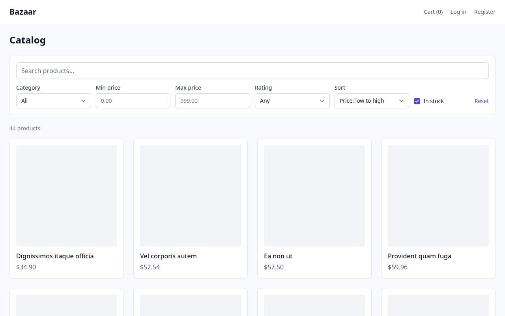
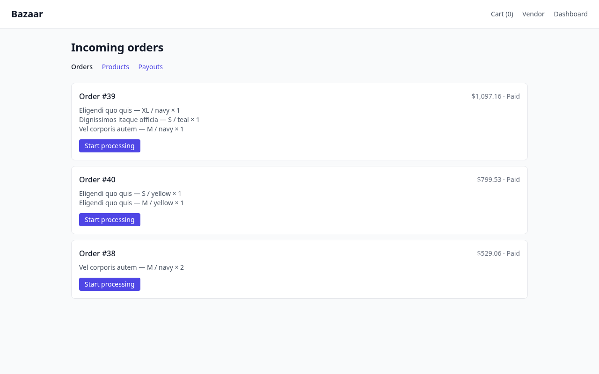
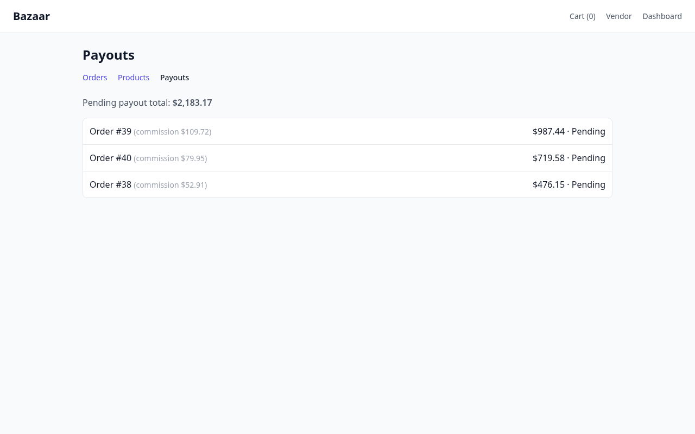
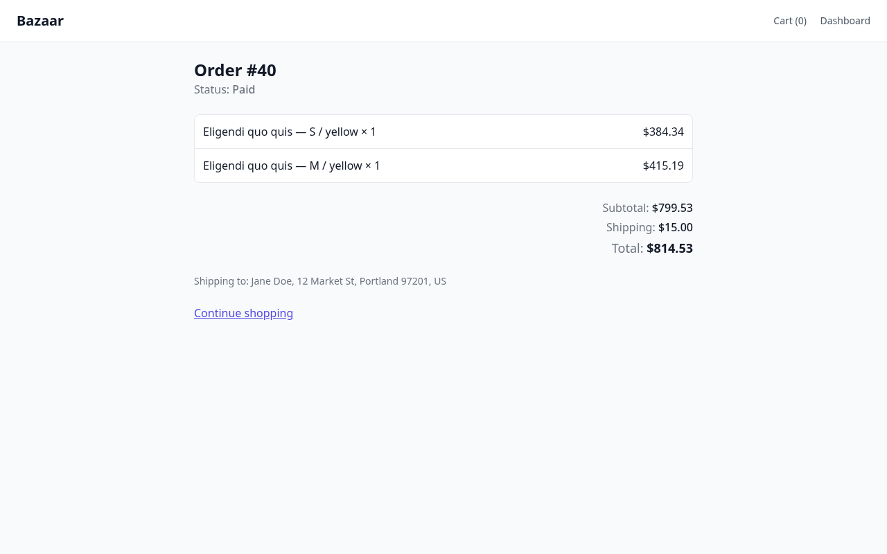
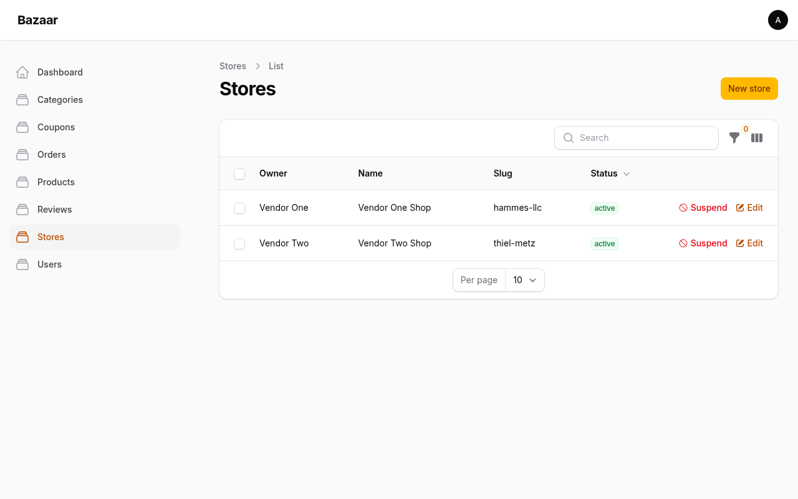
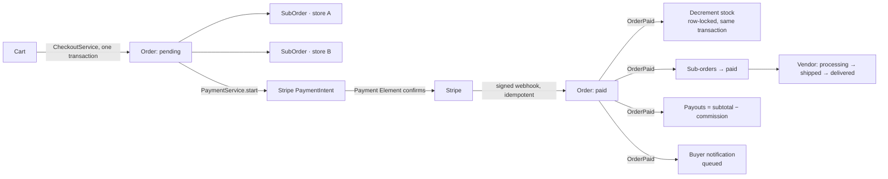

# Bazaar

[](https://github.com/Azazu/bazaar/actions/workflows/ci.yml)

A multi-vendor e-commerce marketplace built with Laravel 13. Sellers run their own storefronts and inventory; buyers browse one catalog, check out once and pay — behind the scenes the order is split into per-store sub-orders, each with its own fulfilment state and payout.

The domain is deliberately the hard part of e-commerce: money, stock under concurrency, payment idempotency, order state machines, multi-tenant authorization. Each of those has a test that proves it — including tests that fork real processes against MySQL.

<table>
  <tr>
    <td></td>
    <td></td>
  </tr>
  <tr>
    <td></td>
    <td></td>
  </tr>
  <tr>
    <td></td>
    <td></td>
  </tr>
</table>

## What's inside

| Area | |
| --- | --- |
| **Storefront** | Catalog with full-text search and facets (category, price range, rating, availability), product galleries (uploads resized to WebP in a queued job), product variants with their own SKU/price/stock, cart (guest session → account cart, merged on login), checkout with coupons, order history |
| **Multi-vendor** | Stores with admin moderation, one checkout split into per-store sub-orders, vendor dashboard (incoming orders, products, payouts), platform commission with exact money math |
| **Payments** | Stripe in test mode (PaymentIntents, Payment Element, signed webhooks, refunds) behind a gateway contract with a keyless sandbox implementation; idempotent "payment succeeded" handling; stock decremented on payment inside the same transaction; cancellation and refunds claim the order under row locks, restore stock and void vendor payouts exactly once, and return the money through an idempotent, retried job with a scheduled reconciliation sweep |
| **Financial history** | Orders, lines, payments, sub-orders and payouts are never deleted: accounts are soft-deleted and anonymised, stores archived, and every foreign key into that history restricts instead of cascading; an account or store with orders in progress cannot be removed |
| **Reviews** | Polymorphic, verified buyers only, one per buyer, moderated in the admin panel |
| **Admin** | Filament panel: store and review moderation, product galleries with drag-and-drop ordering, store logos, categories, coupons, users, orders, marketplace settings (commission rate) |
| **REST API** | `/api/v1` — Sanctum tokens, API Resources, Form Requests, rate limiting, pagination; OpenAPI reference generated from the code at `/docs/api` ([spec](docs/openapi.json)) |

## Engineering highlights

- **Money is integers.** Amounts are stored in minor units and only ever manipulated through `brick/money`; commission rounding reconciles to the cent. → [`app/Listeners/CreatePayouts.php`](app/Listeners/CreatePayouts.php), [`app/Support/helpers.php`](app/Support/helpers.php)
- **No overselling.** Stock is decremented inside the payment transaction under `SELECT … FOR UPDATE`; a shortfall rolls the payment back and the order stays `pending`. Proven by forking 10 buyers racing for the last unit on a real MySQL. → [`app/Services/Stock/StockManager.php`](app/Services/Stock/StockManager.php), [`tests/Concurrency/StockConcurrencyTest.php`](tests/Concurrency/StockConcurrencyTest.php)
- **Idempotent payment confirmation.** Only the signed Stripe webhook marks an order paid — never the redirect back. If an item sold out in between, the webhook refunds (idempotently), cancels the order and tells the buyer, instead of failing and being retried into the same shortage. A unique event ledger, the payment's own status and the state machine each guard the transition, including eight simultaneous deliveries of the same event. An order has one open payment attempt at a time — starting again resumes it under a row lock — and the order records which payment settled it, so a second charge that somehow succeeds is refunded rather than kept. → Checkout reads the buyer, the stores and the variants once, from locked rows inside its transaction, and builds both the snapshot lines and the subtotal from that single read, re-checking that every line is still sellable (published product, active store, existing variant) whatever the cart endpoints allowed earlier. A line whose variant was removed from the catalog after checkout fails payment the same way as a sold-out one (refund, cancel, notify) rather than being skipped, and a variant an open order still needs cannot be removed at all; order lines carry their own snapshot (title, variant, SKU, price). Cancel and refund lock the order and its sub-orders before re-checking the state, so racing cancellations (or a vendor starting fulfilment at the same instant) resolve to one consistent outcome; the provider refund runs after commit as a retried job (`RefundPayment`), and `payments:retry-refunds` re-queues anything left `refund_pending`. → [`app/Http/Controllers/StripeWebhookController.php`](app/Http/Controllers/StripeWebhookController.php), [`app/Services/Payment/PaymentService.php`](app/Services/Payment/PaymentService.php), [`tests/Concurrency/PaymentWebhookConcurrencyTest.php`](tests/Concurrency/PaymentWebhookConcurrencyTest.php), [`tests/Concurrency/PaymentAttemptConcurrencyTest.php`](tests/Concurrency/PaymentAttemptConcurrencyTest.php), [`tests/Concurrency/OrderReversalConcurrencyTest.php`](tests/Concurrency/OrderReversalConcurrencyTest.php)
- **Swappable payment gateway.** `PaymentGateway` has a Stripe implementation (idempotency keys, minor units, refunds via the intent) and a keyless sandbox one; `PAYMENT_GATEWAY` picks the gateway for new payments, nothing else changes — and a refund always goes to the gateway that took the payment (`payments.gateway`), whatever the setting is at that moment, with the provider's refund reference stored for reconciliation. Gateway tests run against a recording HTTP stub, not the network. → [`app/Services/Payment`](app/Services/Payment)
- **State machines, not status strings.** `spatie/laravel-model-states` for orders and sub-orders; illegal transitions throw (`409` on the API). Cancellation and refunds move the order, its sub-orders, stock and payouts together in one transaction. Domain invariants live in services — admins bypass policies, never invariants. → [`app/Services/Order/OrderService.php`](app/Services/Order/OrderService.php)
- **One checkout, N sub-orders, atomically**, with price and title snapshots per line. → [`app/Services/Checkout/CheckoutService.php`](app/Services/Checkout/CheckoutService.php)
- **Authorization as a matrix.** Policies for orders, sub-orders and reviews, roles via `spatie/laravel-permission`, tested end to end on both the web and the API. → [`tests/Feature/AuthorizationTest.php`](tests/Feature/AuthorizationTest.php)
- **In-app and mail notifications.** Every notification goes to mail and the database; the header bell shows the unread ones. Buyers hear about payment, fulfilment progress, cancellations and refunds; vendors about new orders.
- **Events drive side effects.** `OrderPaid` fans out to stock, sub-order states, payouts, a buyer confirmation and one "new order" mail per store; sub-order progress and cancellations/refunds notify the buyer — all queued, dispatched after commit.
- **Media done properly.** Uploads are stored once; `card`/`thumb`/`large` WebP derivatives are generated by a queued job that runs after the transaction commits, URLs fall back to the original until they exist, and files are removed with the row. → [`app/Services/Media/ImageProcessor.php`](app/Services/Media/ImageProcessor.php)
- **Pluggable cart storage.** Session for guests, a Redis account cart for users (shared by the web and the API), guest cart merged into the account on login. → [`app/Services/Cart`](app/Services/Cart)
- **Static analysis at PHPStan level 8** (Larastan), Pint, and a CI pipeline with a dedicated MySQL job for the concurrency suite.

## How an order flows



## REST API

Interactive reference at **`/docs/api`** (generated from the controllers, Form Requests and Resources by Scramble; the exported spec lives in [`docs/openapi.json`](docs/openapi.json)). Stateless, token-authenticated, JSON errors, `60 req/min` per client (`5/min` for token issuance). `POST /orders/{id}/pay` returns the Stripe `client_secret`; the client confirms with the Stripe SDK and polls the order until the webhook marks it paid.

| Method | Endpoint | Auth |
| --- | --- | --- |
| `POST` | `/api/v1/auth/tokens` · `DELETE /api/v1/auth/tokens/current` · `GET /api/v1/me` | — / token |
| `GET` | `/api/v1/categories` · `/api/v1/products?q=&category=&min_price=&max_price=&in_stock=&min_rating=&sort=` · `/api/v1/products/{slug}` · `/api/v1/products/{slug}/reviews` | — |
| `GET/POST/PATCH/DELETE` | `/api/v1/cart` · `/api/v1/cart/items` · `/api/v1/cart/items/{variant}` | token |
| `POST` | `/api/v1/checkout` · `/api/v1/orders/{id}/pay` · `/api/v1/orders/{id}/cancel` | token |
| `GET` | `/api/v1/orders` · `/api/v1/orders/{id}` | token |
| `POST` | `/api/v1/products/{slug}/reviews` | token |

```bash
TOKEN=$(curl -s -X POST localhost:8080/api/v1/auth/tokens -H 'Content-Type: application/json' \
  -d '{"email":"admin@bazaar.test","password":"password","device_name":"cli"}' | jq -r .token)

curl -s 'localhost:8080/api/v1/products?q=lamp&in_stock=1&sort=price_asc' | jq '.data[0]'

curl -s -X POST localhost:8080/api/v1/cart/items -H "Authorization: Bearer $TOKEN" \
  -H 'Content-Type: application/json' -d '{"variant_id":1,"qty":2}' | jq .data
```

## Tech stack

| Layer | Choice |
| --- | --- |
| Framework | Laravel 13, PHP 8.4 |
| Payments | Stripe (test mode) via `stripe/stripe-php`, Payment Element, webhooks |
| UI | Livewire 3 + Volt (storefront, vendor area), Filament 4 (admin), Tailwind |
| Data | MySQL 8, Redis 7 (cache, queue, session, account carts) |
| Media | Intervention Image (GD, WebP) |
| Search | Laravel Scout (database driver; Meilisearch-ready) |
| Domain packages | `brick/money`, `spatie/laravel-model-states`, `spatie/laravel-permission`, `laravel/sanctum` |
| Quality | Pest, Larastan (PHPStan level 8), Pint, GitHub Actions, Dependabot |
| Runtime | Docker: nginx → php-fpm → MySQL + Redis (+ Mailpit for outgoing mail) |

## Getting started

Requires Docker and Docker Compose.

```bash
git clone git@github.com:Azazu/bazaar.git && cd bazaar
cp .env.example .env
make init      # build images, start the stack, install dependencies, generate the key, migrate, link storage
make seed      # demo catalog with generated product images, vendors, reviews, coupons
make assets    # build the front-end
```

| | |
| --- | --- |
| Storefront | http://localhost:8080 |
| Admin panel | http://localhost:8080/admin — `admin@bazaar.test` / `password` |
| Vendor dashboard | log in as `vendor1@bazaar.test` … `vendor4@bazaar.test` / `password`, then **Vendor** in the header |
| Outgoing mail | http://localhost:8080 → Mailpit at http://localhost:8025 |

Payments default to a keyless sandbox gateway. To exercise the real Stripe flow in test mode, set `PAYMENT_GATEWAY=stripe` plus your `pk_test_`/`sk_test_` keys in `.env`, forward webhooks with `stripe listen --forward-to localhost:8080/stripe/webhook` (it prints the `STRIPE_WEBHOOK_SECRET`), and pay with card `4242 4242 4242 4242`. Run `make help` for the full list of targets.

## Testing

```bash
make test               # Pest: unit + feature suites on in-memory SQLite (~3s)
make test-concurrency   # forks real processes against MySQL to prove row locking
```

The default suite covers checkout, Stripe webhook signature verification, payment confirmation and its idempotency, stock decrement and rollback, cancellation and refunds with stock restore, order and sub-order state transitions, coupons, payouts, the authorization matrix, and every API endpoint. The concurrency suite is separate on purpose: SQLite has no row locks to test, so it runs against a MySQL service — locally via `make test-concurrency`, in CI in its own job.

## Quality

`make pint` formats, `make stan` runs Larastan at PHPStan level 8. CI runs four independent jobs on every push and pull request: formatting + static analysis + `composer audit`, the default test suite, the MySQL concurrency suite, and the front-end build. Dependabot keeps Composer, npm and Actions current.

## Roadmap

- [x] Catalog, variants, categories, cart
- [x] Checkout, sandbox payments, order state machine, stock, reviews, coupons
- [x] Multi-vendor: stores, sub-orders, vendor dashboard, payouts, admin moderation
- [x] REST API, search and facets, concurrency tests, Larastan, CI
- [x] Stripe test-mode gateway (Payment Element, signed webhooks, refunds) behind the `PaymentGateway` contract
- [x] Product images (Intervention Image, queued WebP derivatives)
- [x] Automatic refund when an item sells out between checkout and the payment webhook
- [ ] Meilisearch driver, Stripe Connect payouts

## License

Released under the [MIT License](LICENSE).
